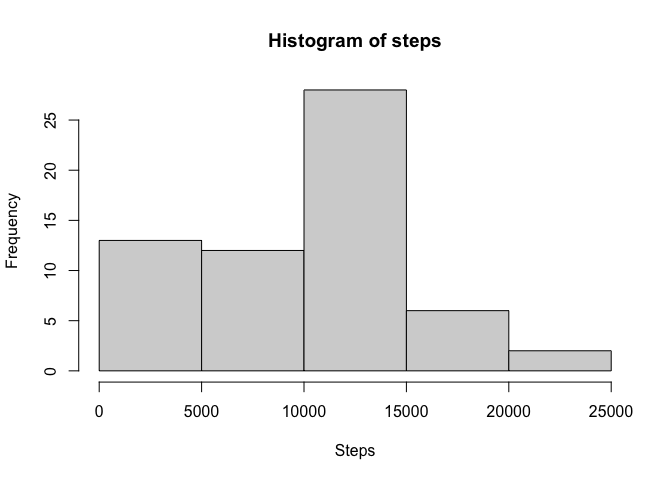
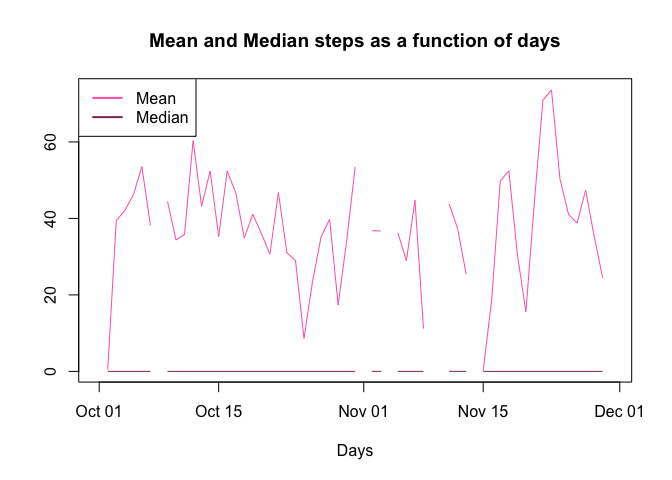
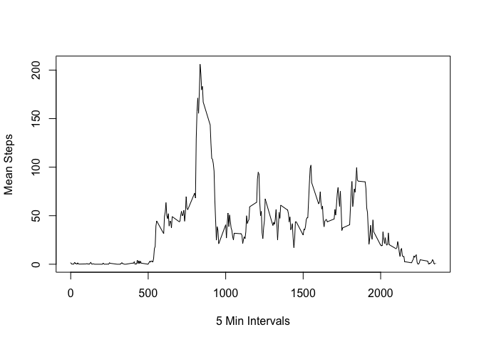
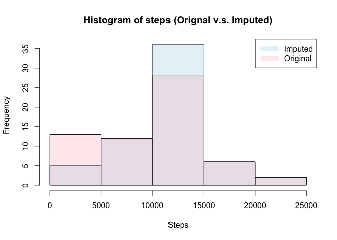
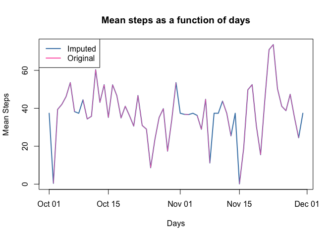
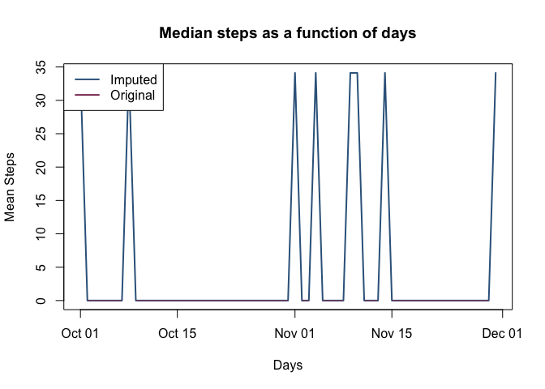
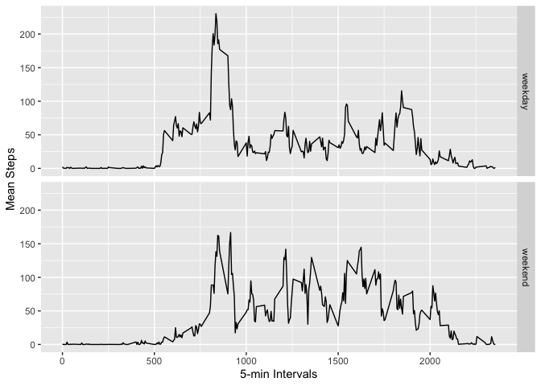

## Reproducible Research: Course Project 1

This document presents some exploratory analysis on data from a personal activity monitoring device. This device collects data at 5 minute intervals through out the day. The data consists of two months of data from an anonymous individual collected during the months of October and November, 2012 and include the number of steps taken in 5 minute intervals each day. The dataset can be downloaded from this [link](https://d396qusza40orc.cloudfront.net/repdata%2Fdata%2Factivity.zip).


## Loading and preprocessing the data

Firstly, download and unzip the dataset. Read the dataset into a tibble. Both the <span style="color: red;">*dplyr*</span> and <span style="color: red;">*lubridate*</span> packages are loaded. The date variable is mutated to the date class using the **ymd()** function.  


```r
# download file
if(!file.exists("repdata_data_activity.zip")) download.file("https://d396qusza40orc.cloudfront.net/repdata%2Fdata%2Factivity.zip","repdata_data_activity.zip")

# Check if directory is available then unzip
if(!file.exists("activity.csv")){
    unzip("repdata_data_activity.zip")
}

library(dplyr)
```

```
## 
## Attaching package: 'dplyr'
```

```
## The following objects are masked from 'package:stats':
## 
##     filter, lag
```

```
## The following objects are masked from 'package:base':
## 
##     intersect, setdiff, setequal, union
```

```r
library(lubridate)
```

```
## 
## Attaching package: 'lubridate'
```

```
## The following objects are masked from 'package:dplyr':
## 
##     intersect, setdiff, union
```

```
## The following objects are masked from 'package:base':
## 
##     date, intersect, setdiff, union
```

```r
data <- tbl_df(read.csv("activity.csv")) %>%
    mutate(date = ymd(date))
str(data)
```

```
## tibble [17,568 × 3] (S3: tbl_df/tbl/data.frame)
##  $ steps   : int [1:17568] NA NA NA NA NA NA NA NA NA NA ...
##  $ date    : Date[1:17568], format: "2012-10-01" "2012-10-01" ...
##  $ interval: int [1:17568] 0 5 10 15 20 25 30 35 40 45 ...
```

## 1. What is mean total number of steps taken per day?

The total number of steps taken per day is calculated and plotted as a histogram. The mean number of steps per day is plotted as a function of days. The broken lines indicate the missing values as a result of ommitting the NA values.


```r
# Total steps per day
stepsbyday <- data %>%
    group_by(day=floor_date(date,"day")) %>%
    summarize(totalSteps=sum(steps,na.rm = TRUE))

#Plot frequency distribution of steps
hist(stepsbyday$totalSteps,main = "Histogram of steps", xlab = "Steps")
```

<!-- -->

The mean and median per day is plotted in the following figure. The large number of NA values and 0s in the data results in the median values turning up as 0s. The summary statistics are shown below the figures.


```r
#Mean per day
meanbyday <- data %>%
    group_by(day=floor_date(date,"day")) %>%
    summarize(meanSteps=mean(steps,na.rm = TRUE))

#Median per day
medianbyday <- data %>%
    group_by(day=floor_date(date,"day")) %>%
    summarize(medianSteps=median(steps,na.rm = T))

#Plot Mean and Median as a fucntion of time
plot(meanbyday$day,meanbyday$meanSteps,type = "l",col="hotpink",
     main = "Mean and Median steps as a function of days",xlab = "Days",
     ylab="")

lines(medianbyday$day,medianbyday$medianSteps,type = "l",col="hotpink4")

legend("topleft",c("Mean","Median"),col=c("hotpink","hotpink4"),lwd=2)
```

<!-- -->

```r
#Summary statitics of total steps by day (original)
summary(stepsbyday$totalSteps)
```

```
##    Min. 1st Qu.  Median    Mean 3rd Qu.    Max. 
##       0    6778   10395    9354   12811   21194
```

## 2. What is the average daily activity pattern?

For each time interval, the mean number of steps across all days are calculated and plotted as a function of 5-min time intervals. The maximum average number of steps occurs at the 835 interval.


```r
stepsbyinterval <- data %>%
    group_by(interval) %>%
    summarize(meanSteps=mean(steps,na.rm = TRUE))

plot(x=stepsbyinterval$interval,y=stepsbyinterval$meanSteps,type = "l",
     ylab="Mean Steps",xlab = "5 Min Intervals")
```

<!-- -->

```r
#Interval with largest mean
stepsbyinterval$interval[which.max(stepsbyinterval$meanSteps)]
```

```
## [1] 835
```

## 3. Imputing missing values

There are 2304 step values which are <span style="color: red;">*NA*</span> in the dataset, which is around 13.11% of the dataset. The <span style="color: red;">*NA*</span> values are replaced with the interval means. The steps "class" have been converted to double to accomodate the mean values. The new dataset is *imData*. 


```r
#Total number of NA values
sum(is.na(data$steps))
```

```
## [1] 2304
```

```r
#Percentage of NA
mean(is.na(data$steps)) * 100
```

```
## [1] 13.11475
```

```r
#impute NA using interval means
imData <- data %>%
    mutate(steps=if_else(is.na(steps),stepsbyinterval$meanSteps[match(interval,stepsbyinterval$interval)],as.double(steps)))
```

The analysis from part 1 is repeated. A comparison of the histograms reveal that there is a significant difference after imputing the data especially between 0 to 5000 and 10000 to 15000.


```r
#Transparent color
c1 <- rgb(173,216,230,max = 255, alpha = 80, names = "lt.blue")
c2 <- rgb(255,192,203, max = 255, alpha = 80, names = "lt.pink")

# Total steps per day
stepsbydayIm <- imData %>%
    group_by(day=floor_date(date,"day")) %>%
    summarize(totalSteps=sum(steps,na.rm = TRUE))

#Plot both histograms
hist(stepsbydayIm$totalSteps, col = c1, main = "Histogram of steps (Orignal v.s. Imputed)",xlab = "Steps")
hist(stepsbyday$totalSteps, col = c2, add = TRUE)

legend("topright",c("Imputed","Original"),col=c(c1, c2), lwd=10)
```

<!-- -->

```r
#Report statistics
summary(stepsbyday$totalSteps)
```

```
##    Min. 1st Qu.  Median    Mean 3rd Qu.    Max. 
##       0    6778   10395    9354   12811   21194
```

The mean and median of the imputed dataset also differs from the original dataset with all NA values ignored. The respective plots show that the missing values have been replaced after imputing. In terms of the summary statistics, imputing the dataset has increased the mean and median values as well as the 25th percentile values.


```r
#Mean per day
meanbydayIm <- imData %>%
    group_by(day=floor_date(date,"day")) %>%
    summarize(meanSteps=mean(steps,na.rm = TRUE))

plot(meanbydayIm$day,meanbydayIm$meanSteps,type = "l",col="steelblue",
     main = "Mean steps as a function of days",xlab = "Days",
     ylab="Mean Steps",lwd=2)
lines(meanbyday$day,meanbyday$meanSteps,col="hotpink")

legend("topleft",c("Imputed","Original"),col=c("steelblue","hotpink"),lwd=2)
```

<!-- -->

```r
#Median per day
medianbydayIm <- imData %>%
    group_by(day=floor_date(date,"day")) %>%
    summarize(medianSteps=median(steps,na.rm = TRUE))

plot(medianbydayIm$day,medianbydayIm$medianSteps,type = "l",col="steelblue4",
     main = "Median steps as a function of days",xlab = "Days",
     ylab="Mean Steps",lwd=2)
lines(medianbyday$day,medianbyday$medianSteps,col="hotpink4")

legend("topleft",c("Imputed","Original"),col=c("steelblue4","hotpink4"),lwd=2)
```

<!-- -->

```r
#Summary statitics of total steps by day (original)
summary(stepsbyday$totalSteps)
```

```
##    Min. 1st Qu.  Median    Mean 3rd Qu.    Max. 
##       0    6778   10395    9354   12811   21194
```

```r
#Summary statitics of total steps by day (imputed)
summary(stepsbydayIm$totalSteps)
```

```
##    Min. 1st Qu.  Median    Mean 3rd Qu.    Max. 
##      41    9819   10766   10766   12811   21194
```

## 4. Are there differences in activity patterns between weekdays and weekends?

To explore the difference in activity patterns between weekdays and weekends, a factor variable "DayType" is added to the imputed data. A panel plot is generated using ggplot2 to show the differences. Through observation, there seems to be more activity in the morning on weekdays and more activity in the afternoon for weekends.


```r
wkndwdyData <- imData %>%
    mutate(DayType=if_else(weekdays(date)=="Saturday" | weekdays(date)=="Sunday","weekend","weekday")) %>%
    mutate(DayType=as.factor(DayType))

stepsbyintervalDayType <- wkndwdyData %>%
    group_by(interval,DayType) %>%
    summarize(meanSteps=mean(steps,na.rm = TRUE))

library(ggplot2)

ggplot(stepsbyintervalDayType, aes(interval,meanSteps)) + geom_line() + facet_grid(rows = vars(DayType)) +
    ylab("Mean Steps") + xlab("5-min Intervals") 
```

<!-- -->

